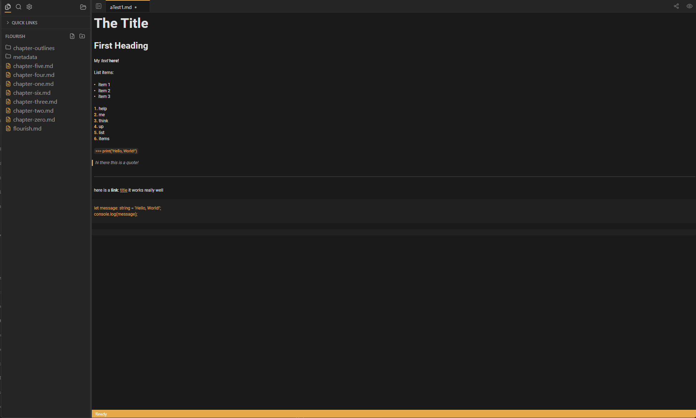

# Markspace

A markdown editor for people who want VS Code's project management without the noise.



## Why Markspace?

Most markdown editors fall into two camps:

- **Note apps** (Obsidian, Bear) — Great for linking ideas, but treat "projects" as an afterthought
- **Code editors** (VS Code) — Great for projects, but cluttered with features you don't need when writing

Markspace sits in the middle. Workspaces, tabs, keyboard-driven navigation—but stripped down to just what you need for writing. Local-first, no account required, your files stay as plain `.md` on disk.

## Download

**[→ Download latest release](https://github.com/YOUR_USERNAME/markspace/releases/latest)**

| Platform | File                                      |
| -------- | ----------------------------------------- |
| Windows  | `Markspace_x.x.x_x64-setup.exe` or `.msi` |
| macOS    | `Markspace_x.x.x_x64.dmg`                 |
| Linux    | `.AppImage`, `.deb`, or `.rpm`            |

> **Note:** Binaries are not yet code-signed. On Windows, click "More info" → "Run anyway". On macOS, right-click → Open.

## Features

### Core Editing
- **Hybrid Live Preview** — Edit markdown source while seeing formatted headers, lists, and links in real-time
- **Full Markdown Support** — Syntax highlighting, standard shortcuts (bold, italic, link, code)
- **Vim Mode** — Optional Vim keybindings for power users

### File Management
- **Workspace Sidebar** — Browse, rename, delete, and create files and folders
- **Tabs** — Open multiple files, reorder via drag-and-drop
- **Hot Exit** — Unsaved changes persist across sessions; you never lose work
- **Quick Links** — Pin favorite folders for fast access

### Search & Navigation
- **Global Search** — Fast search across the entire workspace
- **Find & Replace** — Regex support, occurrence highlighting
- **Command Palette** — Access all commands and files via keyboard

### Sharing & Export
- **Copy as HTML** — Convert markdown to HTML, copied to clipboard
- **Export to PDF** — Styled PDF generation, no print dialog
- **Export to DOCX** — Word-compatible document export

### Customization
- **Themes** — Light, Dark, and Hybrid; persists across sessions
- **UI Settings** — Font size, line numbers, word wrap, accent color

## Keyboard Shortcuts

| Action          | Windows/Linux  | macOS         |
| --------------- | -------------- | ------------- |
| Bold            | `Ctrl+B`       | `Cmd+B`       |
| Italic          | `Ctrl+I`       | `Cmd+I`       |
| Insert Link     | `Ctrl+K`       | `Cmd+K`       |
| Code Block      | `Ctrl+Alt+C`   | `Cmd+Alt+C`   |
| Command Palette | `Ctrl+Shift+P` | `Cmd+Shift+P` |
| Toggle Sidebar  | `Ctrl+\`       | `Cmd+\`       |
| Find            | `Ctrl+F`       | `Cmd+F`       |
| Save            | `Ctrl+S`       | `Cmd+S`       |

## Tech Stack

- [Tauri](https://tauri.app/) — Rust + system webview
- [SvelteKit](https://kit.svelte.dev/) — UI framework
- [CodeMirror 6](https://codemirror.net/) — Editor engine
- [TypeScript](https://www.typescriptlang.org/)

## Development

```bash
# Install dependencies
npm install

# Run dev server (hot reload)
npm run tauri dev

# Build for production
npm run tauri build
```

### IDE Setup

[VS Code](https://code.visualstudio.com/) with:
- [Svelte](https://marketplace.visualstudio.com/items?itemName=svelte.svelte-vscode)
- [Tauri](https://marketplace.visualstudio.com/items?itemName=tauri-apps.tauri-vscode)
- [rust-analyzer](https://marketplace.visualstudio.com/items?itemName=rust-lang.rust-analyzer)

## Roadmap

Upcoming:
- [ ] Workspace-specific settings (`.markspace/config.json`)
- [ ] Quick capture (global hotkey note-taking)
- [ ] Multi-root workspaces

## License

MIT © [Your Name]

---

**Found a bug? Have a feature request?** [Open an issue](https://github.com/YOUR_USERNAME/markspace/issues)